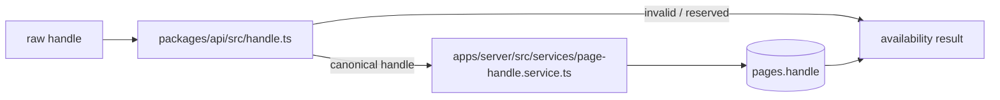

# Handle Policy Foundation - Plan

## Goal Capsule

- **Objective:** handle 예약어 정책과 중복 확인 규칙이 한 곳에서 관리되고, 이후 생성·수정·조회 기능이 같은 규칙을 재사용할 수 있다.
- **Means:** `valibot` 기반의 순수 handle 정책을 `packages/api`에 두고, DB 조회가 필요한 중복 확인은 `apps/server` service에 둔다.
- **Scope:** 이번 단계는 정책 파일 위치, 예약어 목록, 정규화·형식 검사, DB 중복 확인 유틸과 서버 테스트까지만 다룬다.
- **Not in this step:** 웹 입력 화면, 페이지 API controller, public route, migration 적용, handle 변경 history.

---

## Product Contract

### Summary

기준 저장소는 `packages/api/src/index.ts`에 예약어·정규화·schema를 두고, `apps/server/src/services/page-handle.service.ts`에서 DB 중복을 확인한다. 이 구조만 먼저 현재 저장소에 이식해 이후 기능들이 handle 규칙을 복사하지 않게 만든다.

### Problem Frame

handle은 `pages`의 공개 주소이므로 DB 계층과 웹 화면이 각자 검사하면 규칙이 쉽게 어긋난다. 반대로 DB를 모르는 공용 규칙과 DB를 조회하는 서버 함수를 나누면 브라우저 번들에 DB 코드가 들어가지 않고, 중복 판정도 서버에서만 신뢰할 수 있다.

### Requirements

- R1. handle은 `trim → lowercase` 순서로 정규화한다.
- R2. handle은 3~30자의 ASCII 소문자·숫자·하이픈이며, 시작·끝은 영숫자이고 연속 하이픈을 허용하지 않는다.
- R3. 예약어 목록은 handle 정책 파일 한 곳에서 관리하고, 현재 저장소의 정적 웹 경로와 서버 경로를 기준으로 작성한다. 최소 검토 대상은 `api`, `auth`, `billing`, `check`, `pages`, `sign-in`, `new`, `settings`, `admin`, `demo`, `explore`, `health`, `favicon`, `manifest`, `robots`, `sitemap`, `privacy`, `terms`, `update`다.
- R4. 공용 정책은 DB·Hono·React를 import하지 않으며, `valibot` schema의 출력값을 canonical handle로 사용한다.
- R5. 서버 중복 확인 유틸은 raw 입력을 받아 정규화·형식·예약어를 먼저 판정한 뒤 `pages.handle`을 조회한다.
- R6. 중복 확인 결과는 `invalid | reserved | taken | available`을 구분할 수 있어야 한다.
- R7. 서버 테스트는 순수 정책과 DB 조회 유틸의 정상·실패·경계 입력을 확인한다. 웹 테스트는 이번 단계에서 추가하지 않는다.

### Acceptance Examples

- ` My-Page `의 정규화 결과는 `my-page`다.
- `API`, ` api `, `Sign-In`은 예약어다.
- `ab`, `-abc`, `abc-`, `a--b`, `a_b`, `a.b`는 유효하지 않다.
- 이미 `kim`이 저장되어 있을 때 `KIM`은 `taken`이다.
- 형식 오류는 DB 조회를 실행하지 않는다.
- 예약어는 DB 조회를 실행하지 않는다.
- 존재하지 않는 유효 handle은 `available`이다.

### Scope Boundaries

#### Deferred for later

- 생성·수정 controller에서 이 유틸을 호출하는 API 연결.
- DB unique index와 동시 요청에서의 최종 409 처리.
- 웹 debounce, 오류 문구, public `/:handle` route.

#### Outside this product identity

- 이전 handle 보존·redirect·history.
- 익명 availability rate limit과 예약어 관리 화면.

---

## Planning Contract

### Key Technical Decisions

- KTD1. **공용 순수 정책은 `packages/api/src/handle.ts`에 둔다.** 현재 저장소에는 공용 API 패키지가 없지만 서버와 웹이 함께 써야 하는 규칙이므로 새 패키지 하나를 만들 가치가 있다. `packages/db`에는 DB schema만 남긴다.
- KTD2. **`valibot`을 공용 검증 도구로 사용한다.** 기준 저장소의 `pageHandleSchema` 구조를 유지하되 현재 저장소에 이미 있는 Zod와 섞지 않는다. `packages/api`와 서버가 함께 의존하고, 새 검증 라이브러리는 추가하지 않는다.
- KTD3. **DB 중복 확인은 서버 service에 둔다.** `packages/api`의 함수는 문자열만 다루고, `apps/server/src/services/page-handle.service.ts`의 `checkPageHandle`이 `DatabaseClient`와 `pages`를 사용한다.
- KTD4. **예약어는 정적 배열로 시작한다.** route 파일을 실행 중 읽거나 DB에 예약어 row를 추가하지 않는다. 경로가 늘어날 때 같은 정책 파일을 수정하고 테스트를 갱신한다.
- KTD5. **이 함수는 사전 확인이며 최종 중복 방어가 아니다.** 실제 생성·수정 단계에서는 이후 DB unique 제약과 충돌 변환을 추가해야 한다.

### High-Level Technical Design



공용 파일은 다음만 export한다.

- `reservedPageHandles`
- `normalizePageHandle`
- `isReservedPageHandle`
- `pageHandleSchema`
- `handleAvailabilityReasonSchema`, `handleAvailabilityResponseSchema`
- 관련 `valibot` 추론 타입

서버 service는 다음 순서로 동작한다.

1. `normalizePageHandle(rawHandle)`로 표시용 canonical 값을 만든다.
2. `v.safeParse(pageHandleSchema, rawHandle)`가 실패하면 `invalid`를 반환한다.
3. 예약어면 `reserved`를 반환하고 DB를 조회하지 않는다.
4. `eq(pages.handle, parsed.output)`로 조회해 있으면 `taken`, 없으면 `available`을 반환한다.

### File Placement

```text
packages/api/
├── package.json
├── tsconfig.json
└── src/
    ├── handle.ts       # 순수 규칙·예약어·응답 schema
    └── index.ts        # handle.ts export

apps/server/src/services/
└── page-handle.service.ts  # DB를 사용하는 중복 확인 함수

apps/server/tests/
├── services/page-handle.service.test.ts
└── api/handle-policy.test.ts
```

`apps/server/tests/api/handle-policy.test.ts`는 `packages/api`의 순수 함수를 가져와 정책을 확인한다. 실제 DB 접근은 `page-handle.service.test.ts`에만 둔다.

### Evidence and Known Gap

기준 저장소의 근거는 `packages/api/src/index.ts`의 예약어·schema, `apps/server/src/services/page-handle.service.ts`의 availability 함수, `apps/server/src/db/schema.ts`의 `pages.handle` 유니크 인덱스다. 기준 저장소는 생성 controller에서만 예약어를 검사하므로, 이후 API 연결 단계에서는 수정 경로에도 같은 service 정책을 반드시 적용해야 한다.

---

## Implementation Units

### U1. Shared handle policy

- **Goal:** 브라우저와 서버가 함께 사용할 수 있는 `valibot` 기반 순수 handle 정책을 만든다.
- **Requirements:** R1, R2, R3, R4, R6.
- **Files:** `packages/api/package.json`, `packages/api/tsconfig.json`, `packages/api/src/handle.ts`, `packages/api/src/index.ts`, `apps/server/tests/api/handle-policy.test.ts`.
- **Approach:** 기준 저장소의 3~30자 규칙과 예약어 배열을 옮기되 `log-in` 대신 현재 경로 `sign-in`을 반영한다. schema transform 결과를 저장·조회에 사용할 canonical 값으로 삼는다. `valibot` 의존성은 workspace catalog에 등록한다.
- **Test scenarios:** 공백·대문자 정규화, 길이 경계, 시작·끝 하이픈, 연속 하이픈, 허용되지 않은 문자, 예약어 대소문자 변형, 응답 schema의 네 상태를 확인한다.
- **Verification:** `bun test`와 `bun run --filter @grabbin/api check-types`를 실행한다.

### U2. Database duplicate-check utility

- **Goal:** DB를 아는 서버 함수 하나로 handle availability를 판정한다.
- **Requirements:** R5, R6, R7, KTD3, KTD5.
- **Files:** `apps/server/src/services/page-handle.service.ts`, `apps/server/tests/services/page-handle.service.test.ts`, `apps/server/package.json`.
- **Approach:** `checkPageHandle({ db, rawHandle })`를 기준 함수로 두고, invalid/reserved에서는 조기 반환한다. valid handle만 `pages.handle`을 조회한다. 이 단계에서는 생성·수정 controller나 DB migration을 연결하지 않는다.
- **Test scenarios:** invalid/reserved 입력에서 query가 실행되지 않는지, canonical handle로 조회하는지, existing page가 `taken`, 없는 page가 `available`인지, 저장값이 대문자일 때도 정책상 canonical 비교가 일관적인지 확인한다.
- **Verification:** `bun test`와 `bun run --filter server check-types`를 실행한다.

---

## Verification Contract

| Gate | Evidence | Applies to |
| --- | --- | --- |
| Policy behavior | `bun test`; normalization, boundary, reserved cases | U1 |
| Server utility | `bun test`; query skip and taken/available results | U2 |
| Type boundary | API package and server typechecks | U1, U2 |
| Scope proof | `git diff --stat`; only policy, utility, dependency, and tests changed | U1, U2 |

이 단계의 결과는 “중복 확인 유틸이 준비됨”까지다. 실제 생성·수정 성공을 주장하지 않으며, DB unique migration과 API 연결은 다음 단계에서 별도로 검증한다.

## Definition of Done

- `valibot` 기반 handle schema와 예약어 목록이 `packages/api/src/handle.ts` 한 곳에 있다.
- `packages/api`는 DB·Hono·React를 import하지 않는다.
- `checkPageHandle`은 invalid/reserved에서 DB를 조회하지 않고, valid 입력만 canonical handle로 조회한다.
- 정책 테스트와 서버 service 테스트가 추가된다.
- 웹 화면·controller·migration·handle history 코드는 이번 변경에 포함되지 않는다.
- 현재 사용자의 기존 dirty 변경은 보존된다.

---

## Appendix

### Reference behavior summary

- 기준 저장소는 `reservedPageHandles`, `normalizePageHandle`, `isReservedPageHandle`, `pageHandleSchema`를 공용 API 패키지에서 export한다.
- availability 함수는 normalize → schema 검증 → reserved 판정 → DB 조회 순서다.
- 기준 저장소의 실제 이름은 `checkPageHandle`이며, 이번 프로젝트에서도 같은 이름을 유지해 이후 controller 연결 시 찾기 쉽게 한다.
